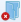
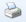

# Лента справочника

1. **Дела**.
   1. **Добавить дело** () – открывает новую карточку дела. Кнопка доступна в состоянии номенклатуры дел Подготавливается и Утверждена.
   2. **Открыть дело** () – открывает карточку дела, строка которого выделена в таблице дел на правой панели справочника.
   3. **Удалить дело** () – выводит на экран диалоговое окно, в котором можно подтвердить (нажав кнопку Да) или отклонить (Нет) удаление выделенной в таблице дел карточки дела. При подтверждении удаления карточка удаляется. Кнопка доступна в состоянии дела Подготавливается.
2. **Разделы**.
   1. **Добавить раздел** () – открывает окно добавления раздела. Кнопка доступна в состоянии номенклатуры дел Подготавливается 
   2. **Переименовать раздел** () – открывает окно для переименования выделенного раздела. Кнопка доступна в состоянии номенклатуры дел Подготавливается 
   3. **Удалить раздел** () – выводит на экран диалоговое окно, в котором можно подтвердить (нажав кнопку Да) или отклонить (Нет) удаление выделенного раздела. При подтверждении удаления раздел удаляется. Кнопка доступна в состоянии номенклатуры дел Подготавливается.
3. **Номенклатура дел на год**.
   1. **Добавить год** ( – раскрывает список для выбора способа создания номенклатуры дел: копированием или "с нуля".
   2. **Изменить год** () – открывает окно для изменения года (переименования) открытой номенклатуры. Кнопка доступна в состоянии номенклатуры дел Подготавливается.
   3. **Удалить год** ()– выводит на экран диалоговое окно, в котором можно подтвердить (нажав кнопку Да) или отклонить (Нет) удаление открытой номенклатуры дел. При подтверждении удаления номенклатура удаляется. Кнопка доступна в состоянии номенклатуры дел Подготавливается.
   4. **Утвердить** () – переводит номенклатуру дел в состояние Утверждена, все дела номенклатуры - в состояние Формируется. Кнопка доступна в состоянии номенклатуры дел Подготавливается.
   5. **К подготовке** () – переводит номенклатуру дел в состояние Подготавливается, все дела номенклатуры - в состояние Подготавливается. Кнопка доступна в состоянии номенклатуры дел Утверждена.
   6. **Закрыть** () – переводит номенклатуру дел в состояние Закрыта, все дела номенклатуры - в состояние Закрыто. Кнопка доступна в состоянии номенклатуры дел Утверждена.
   7. **Печать** () – открывает окно Экспорт и печать для печати номенклатуры дел на год.