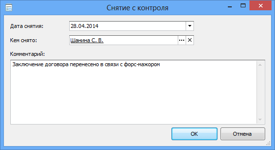

# Снятие документа с контроля

Снять документ с контроля может сотрудник, указанный в поле Контролер или Делопроизводитель карточки документа.

Для снятия исполняемого документа с контроля без изменения его состояния выполните следующие действия:

1. Перейдите в папку Документы у меня на контроле и найдите нужную карточку.

2. Откройте карточку документа. При необходимости перейдите на вкладку Регистрация и раскройте секцию Контроль.

3. В поле Состояние выберите значение «Снят с контроля».

   Откроется диалоговое окно для снятия документа с контроля. В этом окне в качестве даты снятия с контроля будет указана текущая дата, а в качестве снявшего с контроля – текущий пользователь.

   

4. При необходимости установите в поле Дата снятия с контроля дату, отличную от текущей.

5. При необходимости измените значение поля Кем снято.

6. Введите комментарий о причинах снятия с контроля.

7. Нажмите кнопку **OK**.

8. Сохраните сделанные изменения в карточке документа.