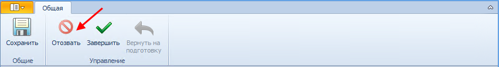

# Отзыв резолюции

Если автор резолюции считает, что ее исполнение дальше нецелесообразно, то он может отозвать ее.

Для отзыва запущенной резолюции выполните следующие действия:

1. Откройте карточку запущенной резолюции.

2. Нажмите на ленте карточки кнопку **Отозвать**.

   

   Появится предупреждающее сообщение об отзыве подчиненных заданий и резолюций.

3. Примите решение по отзыву резолюции.

   Резолюция переводится в состояние «Отзывается», отзываются все задания и все подчиненные резолюции вниз по дереву резолюций.