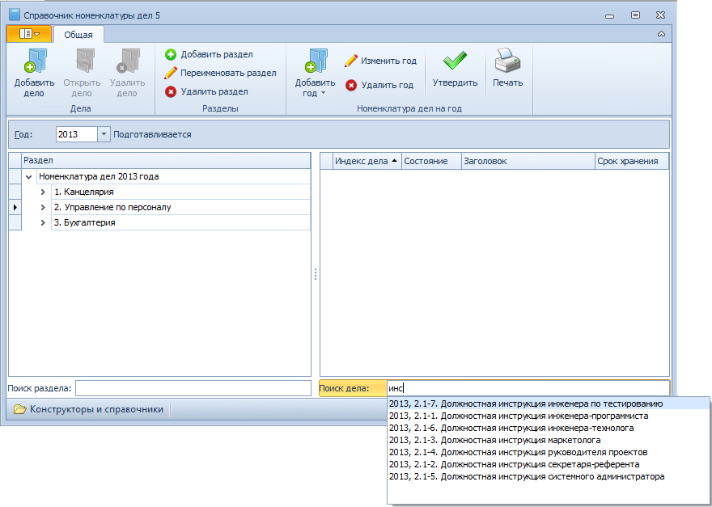

# Поиск дела

Поиск дела в Справочнике номенклатуры дел 5 может проводиться по индексу или названию дела.

Для выполнения поиска выполните следующие действия:

1. Откройте Справочник номенклатуры дел 5.

2. Если известен раздел, в котором находится разыскиваемое дело, перейдите в него, выделив в дереве номенклатуры. Если раздел неизвестен, этот шаг можно пропустить.

3. Введите в поле Поиск дела несколько идущих подряд символов (не менее трех), которые содержатся в индексе или названии нужного дела.

   

4. В раскрывающемся списке будут представлены все найденные дела, в названии которых содержатся заданные символы.

5. Выберите нужную запись.

Искомое дело будет выделено в таблице дел на правой панели справочника.