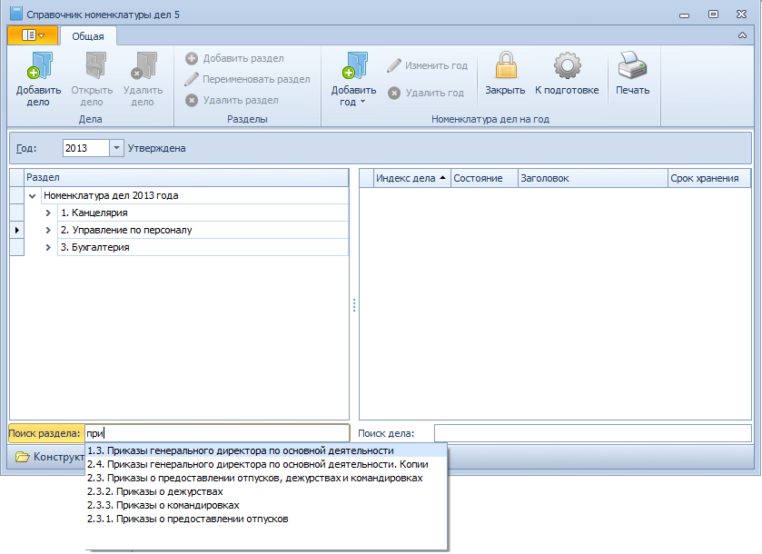

# Поиск раздела

Поиск записи о разделе в Справочнике номенклатуры дел 5 может проводиться по индексу или названию раздела.

Для выполнения поиска выполните следующие действия:

1. Откройте Справочник номенклатуры дел 5.

2. Введите в поле Поиск раздела несколько идущих подряд символов (не менее трех), которые содержатся в названии или индексе раздела.

   

3. В раскрывающемся списке будут представлены все найденные разделы, в названии которых содержатся заданные символы.

4. Выберите нужную запись.

Искомый раздел будет выделен в справочнике.