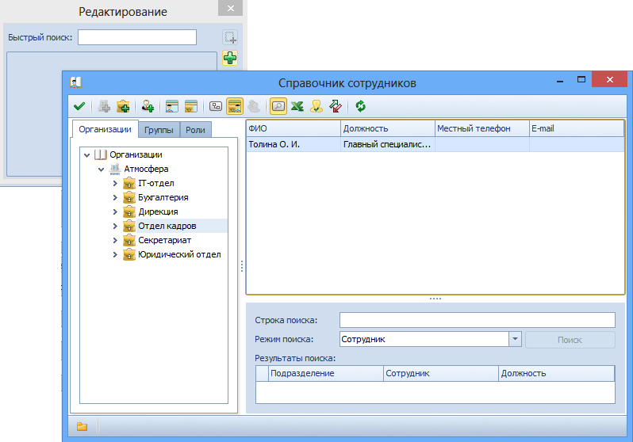

# Выбор адресатов и получателей

Указание адресатов и получателей в карточке ДокументДП вида Входящий может производится непосредственным выбором из Справочника сотрудников или с помощью быстрого поиска. Кроме того, значение поля Адресаты может быть скопировано в поле Получатели.

Для указания адресатов выполните следующие действия:

1. Откройте карточку документа и перейдите на вкладку Регистрационные данные.
2. Для ввода адресатов с помощью быстрого поиска выполните действия:
   1. Установите курсор в поле Адресаты.
   2. Введите в поле несколько идущих подряд символов (не менее трех) из фамилии сотрудника.
   3. Выберите нужного сотрудника в раскрывшемся списке.
   4. При необходимости повторите операцию.
3. Для выбора адресата из справочника сотрудников выполните действия:
   1. Нажмите кнопку  справа от поля Адресаты.
   
   2. В открывшемся окне Редактирование нажмите кнопку .
   
   3. Выберите нужного сотрудника (нескольких сотрудников, группу, роль) в открывшемся на выбор окне Справочника сотрудников и нажмите кнопку .
   
      
   
   4. Поле Получатели заполняется аналогично полю Адресаты. Кроме того, при нажатии кнопки , расположенной справа от поля Адресаты, значения из этого поля будут перенесены в поле Получатели.