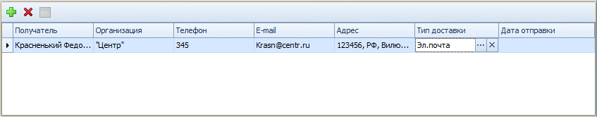

# Выбор получателей исходящего документа

Получатели исходящего документа выбираются в таблице Получатели вкладки Регистрационные данные следующим образом:

1. Откройте карточку исходящего документа и перейдите на вкладку Регистрационные данные к секции Получатели.

   

2. Нажмите кнопку .

   Будет добавлена новая строка в таблицу получателей.

3. Установите курсор в колонку «Получатели» и нажмите кнопку .

   Будет открыт Справочник контрагентов в режиме выбора.

4. Выберите нужного сотрудника контрагента и нажмите кнопку .

   Данными из справочника контрагентов автоматически будут заполнены поля Организация, Телефон, e-mail, Адрес.

   > Если для организации в Справочнике контрагентов не указано контактное лицо или у контактного лица не указан адрес, то в столбце Адрес будет отображен полный адрес организации (включая индекс).

5. При необходимости вручную отредактируйте данные автоматически заполняемых полей.

6. Установите курсор в колонку Тип доставки и нажмите кнопку .

   Будет открыт Конструктор справочников в режиме выбора.

7. Выберите тип доставки и нажмите кнопку .