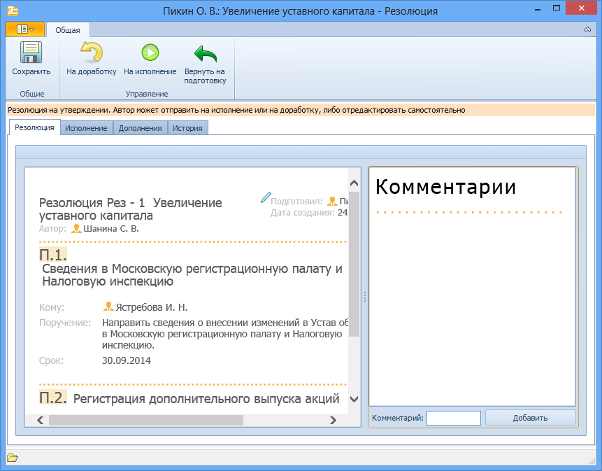

# Отправка резолюции на доработку

Автор резолюции, получив подготовленную от его имени резолюцию, может утвердить ее, отправив на исполнение, или отправить подготовившему на доработку.

Для отправки на доработку резолюции выполните следующие действия:

1. Откройте карточку резолюции в состоянии «На утверждении» или «Подготавливается» и ознакомьтесь с ее содержанием.

   Если автор резолюции включен в группу «Автор резолюции - редактор» в Справочнике сотрудников, то карточка резолюции будет открыта в редактируемой форме, иначе – в форме для чтения.

   

2. Оставьте комментарий о причинах отправки резолюции на доработку. Для этого установите курсор в поле Комментарий, введите нужный текст и нажмите кнопку **Добавить**.
3. Нажмите на ленте инструментов карточки кнопку **На доработку**. Карточка Резолюция будет закрыта, резолюция будет возвращена подготовившему ее сотруднику.

