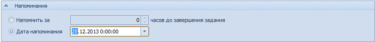

# Установка напоминания о задании

При работе с заданиями предусмотрена возможность установки напоминания о задании. При этом можно указать или точную дату напоминания, или срок относительно времени завершения задания.

**При настройке напоминаний и для их получения должен быть открыт Microsoft Outlook.**

Для создания напоминания о сроках исполнения задания выполните следующие действия:

1. Перейдите к группе полей Напоминания на вкладке Задание карточки Задание установите флажок **Напомнить за**, либо точную дату напоминания. 

   

2. Для указания точной даты напоминания установите переключатель в положение **Дата напоминания** и выберите дату с помощью календаря или введите вручную в формате, указанном в настройках операционной системы.

3. Для настройки напоминания о том, что срок завершения задания истекает, установите переключатель в положение **Напомнить за <...> часов до завершения задания** и введите срок напоминания вручную или с помощью счетчика.

