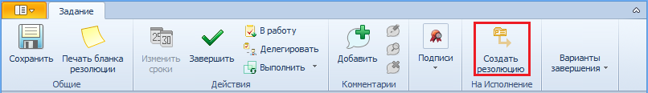

# Создание резолюции из карточки задания «На рассмотрение»

Для создания резолюции из карточки задания На рассмотрение выполните следующие действия:

1. Откройте карточку задания и ознакомьтесь с приложенным документом.

2. Нажмите кнопку **Создать резолюцию**.

   

   > По кнопке **Создать резолюцию** может быть открыт список доступных разновидностей резолюции, настроенных администратором.

   Будет открыта новая карточка резолюции, к которой будет приложен исполняемый документ.

3. [Заполните поля карточки](Schedule_Resolution.md) резолюции. Сохраните резолюцию или сразу отправьте ее [на исполнение](Sent_Resolution_for_Execution.md) или [на утверждение](Sent_Resolution_for_Approval.md).

4. При старте резолюции состояние задания На рассмотрение изменяется на «Завершено».

