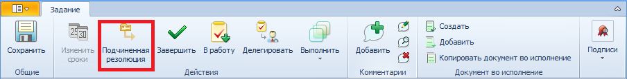
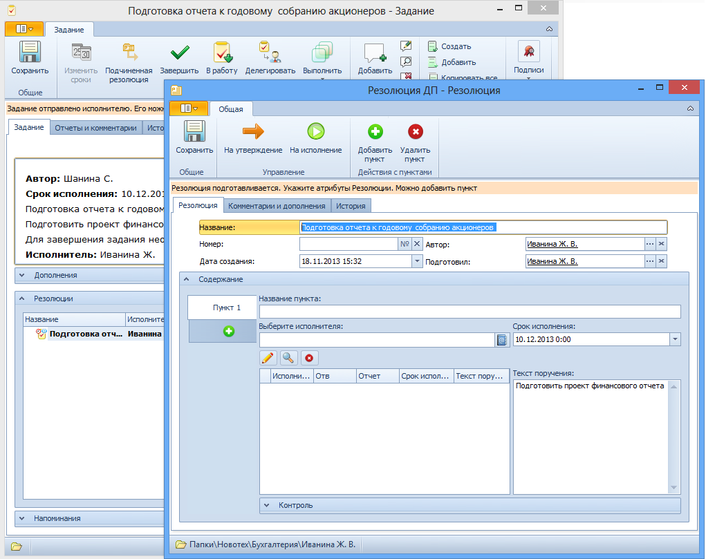

# Создание резолюции из карточки задания «По резолюции»

При получении задания По резолюции можно создать из него подчинённую резолюцию. Для этого следует выполнить следующие действия: 

1. Открыть карточку задание По резолюции.

2. Нажать кнопку **Подчиненная резолюция** на ленте инструментов карточки.

   

   > По кнопке **Подчиненная резолюция** может быть открыт список доступных разновидностей резолюции, настроенных администратором.

3. При этом будет открыта карточка новой резолюции. Если в Справочнике видов карточки выполнены соответствующие настройки, то часть полей карточки резолюции будет заполнена сведениями из карточки задания (по умолчанию это поля Название, Текст поручения и Дата завершения).

   