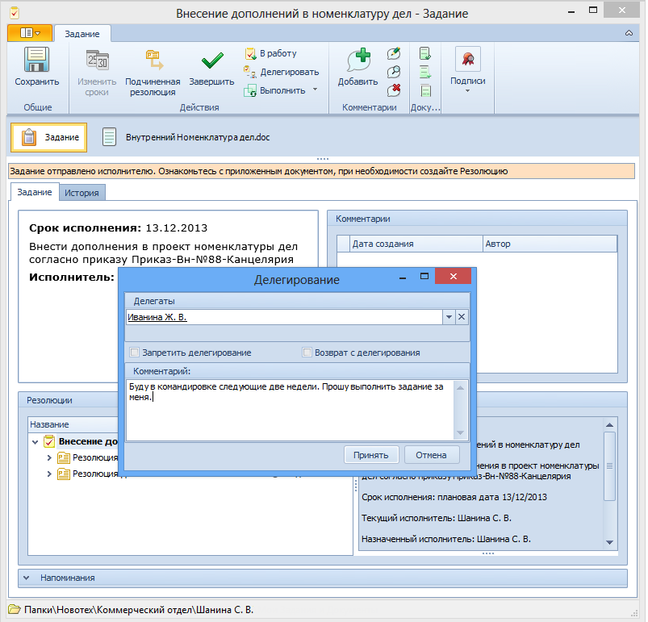

# Делегирование

Полученное задание может быть передано (делегировано) для исполнения другому исполнителю. Новый исполнитель получает делегированные задания так же, как и новые. Если не установлен запрет на дальнейшее делегирование, задание можно делегировать произвольное количество раз.

Для делегирования задания выполните следующие действия.

1. Откройте полученную карточку Задание.

2. Нажмите на ленте инструментов карточки кнопку **Делегировать**.

3. В открывшемся диалоговом окне укажите, кому делегируется задание и требуется ли его возврат. Для этого:

   1. В поле Делегаты выберите новых исполнителей задания.

   2. Чтобы установить запрет на дальнейшее делегирование задания, установите флаг **Запретить делегирование**.

      У делегата, получившего задание, в карточке будет недоступна операция делегирования.

   3. Чтобы после завершения выполнения задания делегатом задание вернулось обратно сотруднику, выполнившему делегирование, установите флаг **Возврат с делегирования**.

      Если данный флаг не установлен, выполненное делегатом задание будет завершено.

      

4. Нажмите на кнопку **Принять** в окне Делегирование.

   При этом карточка Задание будет закрыта. Состояние карточки будет изменено на «Делегировано». Карточка будет отображаться в папке маршрутизации `Мои задания - Исходящие - Делегировано`.

   Сотрудник, получивший делегированное задание, становится текущим исполнителем.