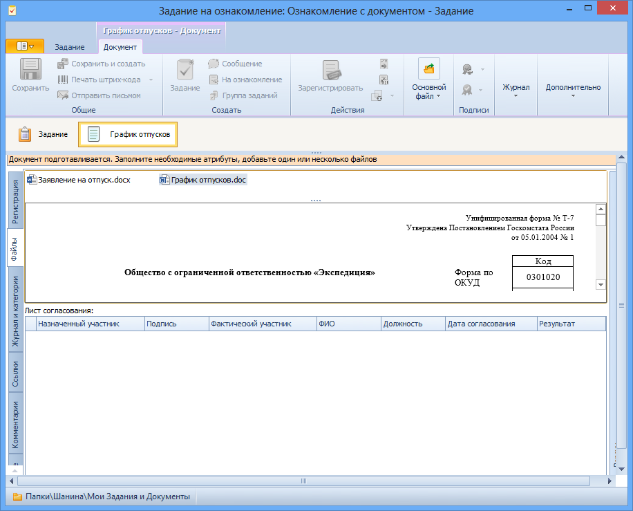

# Просмотр приложенного к заданию документа

Для ознакомления с приложенным к заданию файлом документа выполните следующие действия:

1. Откройте полученную карточку задания.

   

2. Щелкните левой клавишей мыши по значку документа на панели вложений карточки.

   Будет открыта карточка документа.

   

3. В карточке документа перейдите на вкладку Файлы и ознакомьтесь с файлом документа одним из способов:
   - выделите имя нужного файла в списке; содержимое файла будет отображено в области предварительного просмотра;
   - дважды щелкните левой клавишей мыши по имени нужного файла; документ будет открыт в приложении, предназначенном для работы с файлами данного формата.