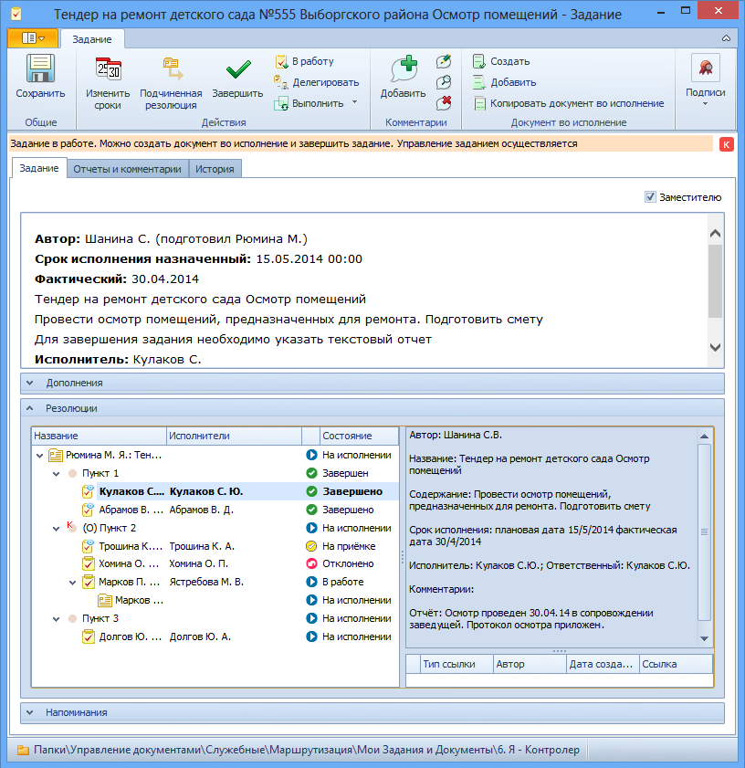
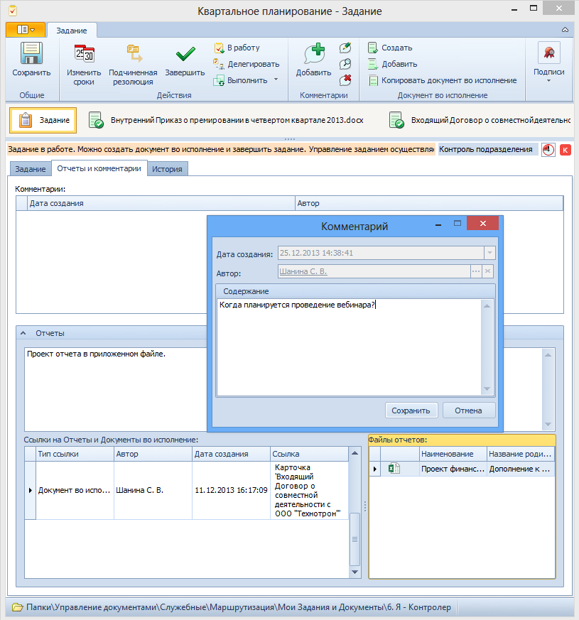

# Контроль хода исполнения

Контроль выполнения заданий позволяет отследить текущее состояние задания, понять, кто из исполнителей работает с заданием, и посмотреть сроки выполнения задания.

Контролировать ход исполнения заданий пункта резолюции может автор резолюции, контролер и ответственный исполнитель, указанные в пункте резолюции.

Чтобы проконтролировать ход исполнения задания, выполните следующие действия:

1. Откройте карточку задания, выполнение которого требуется проконтролировать.

   > Папка, в которой отображается контролируемое задание, определяется ролью пользователя в карточке. См. пункт [Описание папок приложения](Folder_Application_OfficeWork.md).

2. Перейдите к секции Резолюции и ознакомьтесь с процессом выполнения задания.

   

3. Перейдите на вкладку Отчеты и комментарии, чтобы ознакомиться с комментариями исполнителей и сроками выполнения задания. При необходимости добавьте собственный комментарий.

   

4. При необходимости выполните доступные [операции с заданием](Task_Fulfil.md).