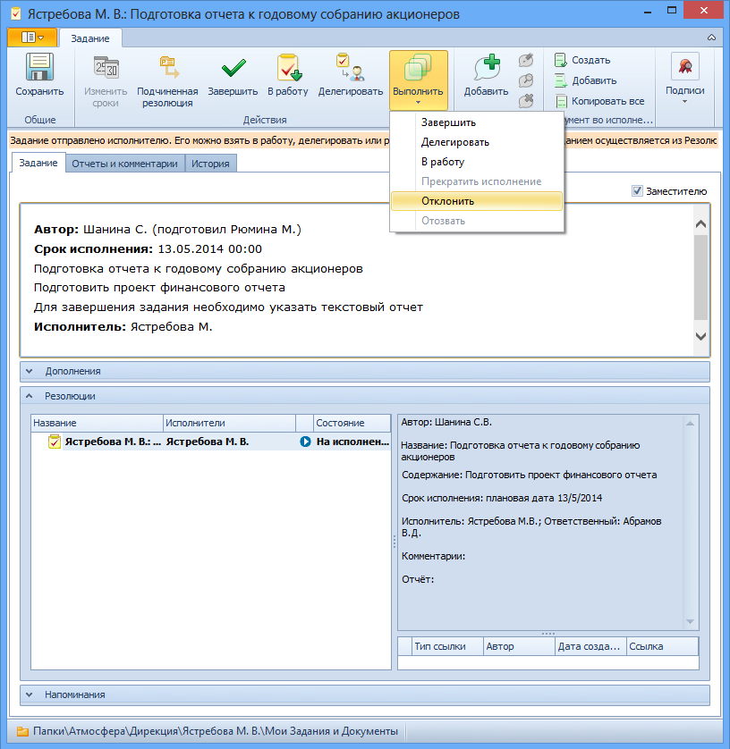

# Отказ от исполнения

Если задание было доставлено исполнителю по ошибке, он может отказаться от выполнения задания.

Для отказа от выполнения задания выполните следующие действия:

1. Откройте карточку Задание.

2. На ленте карточки нажмите на кнопку **Выполнить** и затем выберите в контекстном меню команду **Отклонить**.

   

Карточка задания будет переведена в состояние «Отклонено». Отклоненное задание исполнитель может взять в работу, нажав кнопку **В работу**.