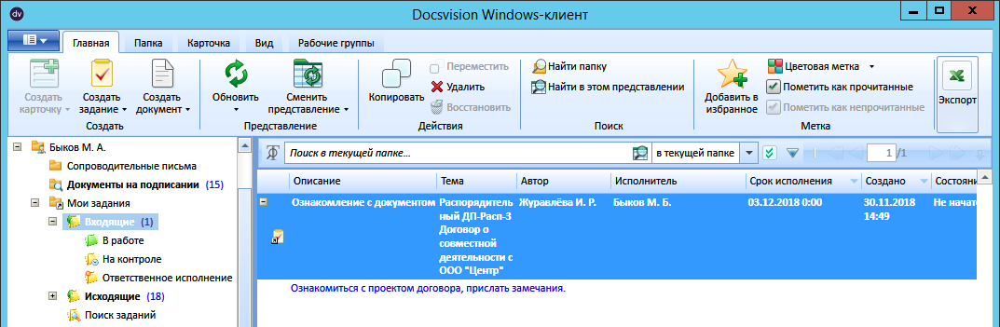
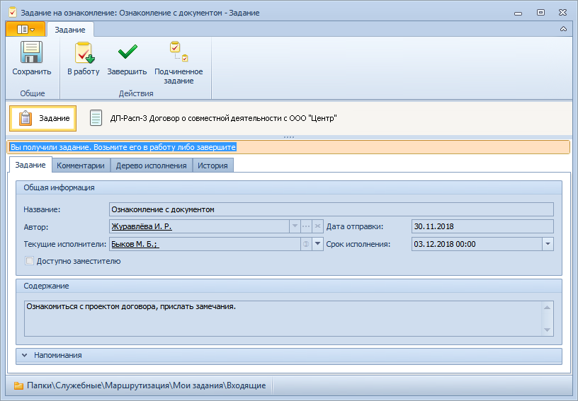

# Порядок работы с заданием «На ознакомление»

Задание На ознакомление создается системой автоматически при отправке карточки ДокументДП на ознакомление. Полученное задание содержит вложенную карточку родительского документа.

Чтобы получить задание На ознакомление и исполнить его, выполните следующие действия: 

1. В личной папке перейдите в папку маршрутизации встроенного `Мои задания - Входящие` (приложения «Управление документами») и найдите нужную карточку задания с описанием «Ознакомление с документом».

   

2. Откройте полученную карточку задания На ознакомление.

   

3. [Ознакомьтесь](Task_Familiarization_with_Documents.md) с приложенными файлами документа.