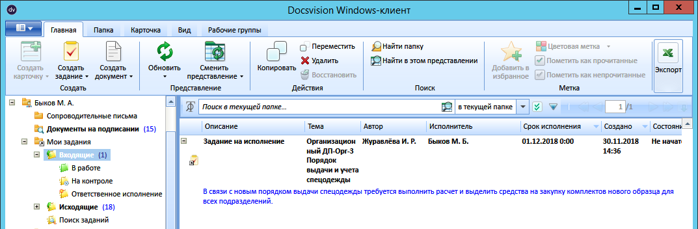
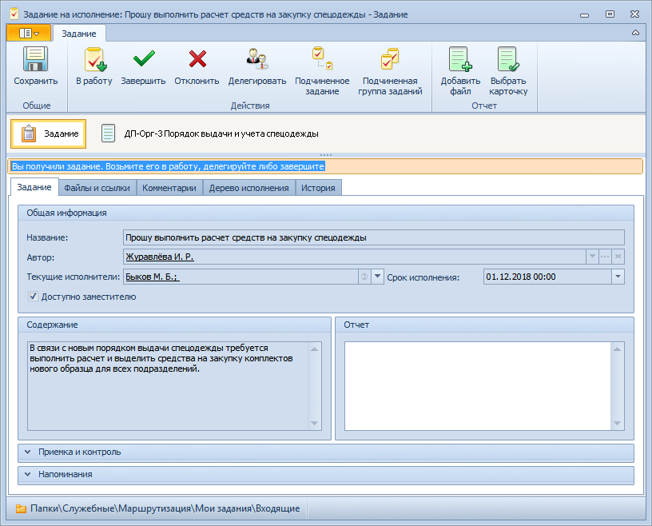

# Порядок работы с заданием «На исполнение»

Задание На исполнение создается системой автоматически при отправке карточки ДокументДП на исполнение. Полученное задание содержит вложенную карточку родительского документа.

Чтобы получить задание На исполнение и исполнить его, выполните следующие действия: 

1. В личной папке перейдите в папку маршрутизации `Мои задания - Входящие` (приложения «Управление документами») и найдите нужную карточку задания с описанием «Задание на исполнение».

   

2. Откройте полученную карточку задание На исполнение.

   

3. Выполните необходимые действия с карточкой.

   Описание работы с заданиями на исполнение приведено в документе *Приложение «Docsvision 5. Управление документами». Руководство пользователя*.