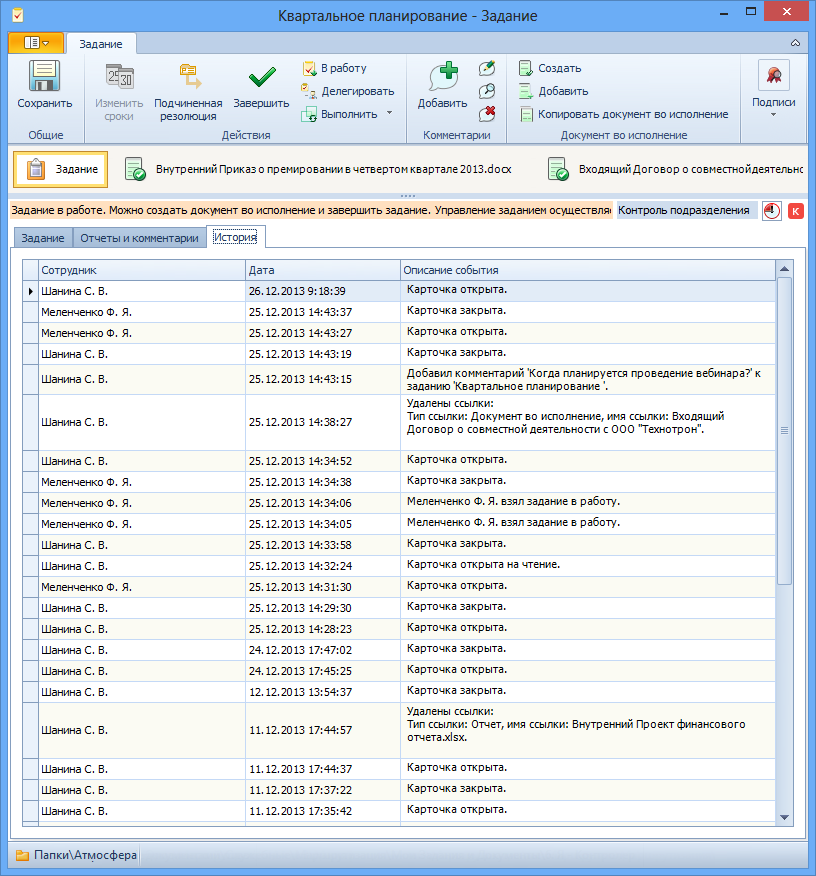

# Вкладка «История»

На вкладке отображается история операций с карточкой.

Поля вкладки «История»:

1. **История операций с карточкой** – таблица, в которой отображаются все действия с карточкой. Заполняется автоматически по мере совершения операций с карточкой.

