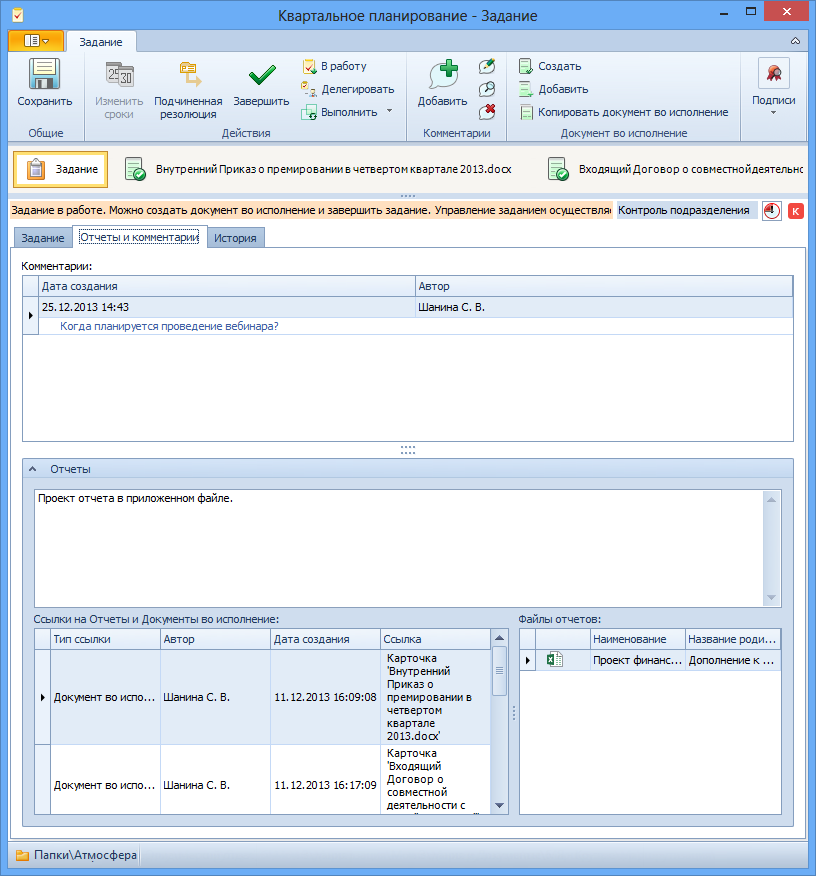

# Вкладка «Отчеты и комментарии»

Вкладка служит для добавления комментариев к заданию, отчетов и документов во исполнение.

1. **Комментарии** – комментарии к заданию. См. пункт [Добавление комментария к заданию](Add_Comments_Task.md).
2. **Отчеты** – поле для ввода текстового отчета. Вводится вручную.
3. **Ссылки на Отчеты и Документы во исполнение** – в поле отображаются ссылки на прикрепленные к заданию отчеты и документы во исполнение. Для добавления ссылки:
   1. Выберите из контекстного меню поля опцию Добавить карточку.
   2. Выберите тип объекта, который следует добавить в карточку: 
      - Документ во исполнение;
      - Отчет.
   3. В открывшемся окне выберите добавляемую карточку и нажмите кнопку .
4. **Файлы отчетов** – в поле отображаются ссылки на прикрепленные к заданию файлы отчетов.
   1. Выберите из контекстного меню поля опцию Добавить файл.
   2. В окне «Выберите файл документа» выберите файл файловой системы.

