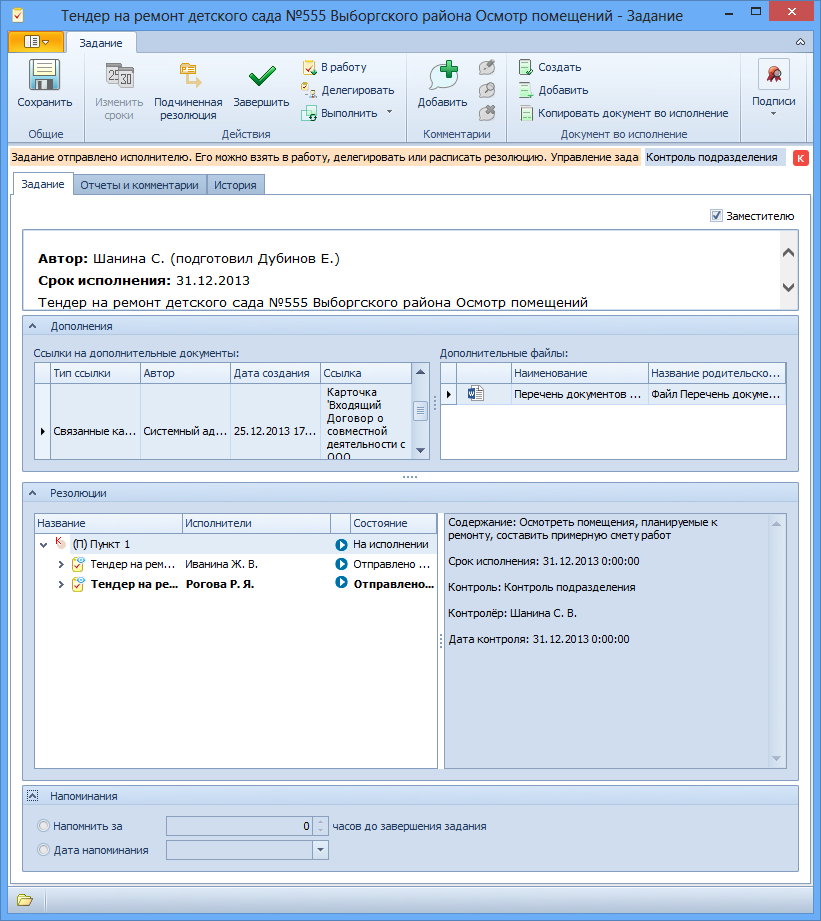

# Вкладка «Задание»

Вкладка содержит сведения о задании, необходимые для его исполнения.

1. **Общие сведения** – общие сведения о задании. Заполняется автоматически.
2. **Заместителю** – показывает, будет ли задание подчиненной резолюции отправлено временному заместителю в случае недоступности назначенного исполнителя. Устанавливается щелчком левой клавиши мыши.
3. **Дополнения**.
   1. **Ссылки на дополнительные документы** – ссылки на карточки документов, прикрепленные к родительской резолюции. Заполняется автоматически.
   2. **Дополнительные файлы** – ссылки на файлы, прикрепленные к родительской резолюции. Заполняется автоматически.
4. **Резолюции**.
   1. **Дерево резолюций** – отображает ход исполнения заданий в виде упорядоченной иерархической структуры(дерева). См. пункт [Дерево резолюций](Tree_Resolution.md). Формируется автоматически при запуске резолюции на исполнение. Изменяется и дополняется автоматически при создании дочерних резолюций и внесении изменений в запущенную резолюцию.
5. **Напоминания**.
   1. **Напомнить за <...> часов** – позволяет настроить в Microsoft Outlook напоминание о том, что срок завершении задания истекает через указанное количество часов. Установите переключатель **Напомнить за** и введите срок напоминания вручную или с помощью счетчика. При этом должен быть открыт Microsoft Outlook.
   2. **Дата напоминания** – позволяет указать в Microsoft Outlook дату напоминая об истечении срока исполнения задания. Установите переключатель **Дата напоминания** и выберите дату с помощью календаря или введите вручную в формате, указанном в настройках операционной системы. При этом должен быть открыт Microsoft Outlook.