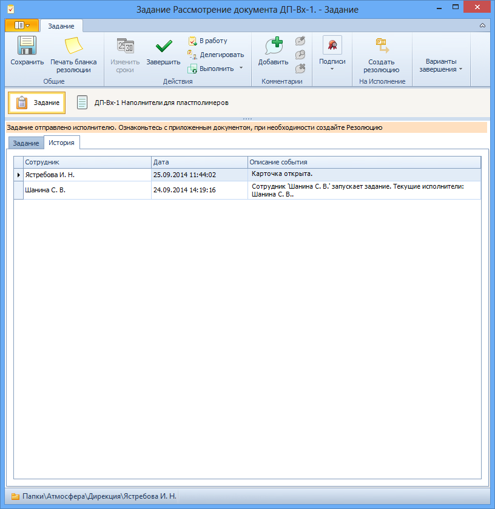

# Вкладка «История»

Поля вкладки История:

1. **История операций с карточкой** – таблица, в которой отображаются все действия с карточкой задания. Заполняется автоматически по мере совершения операций с карточкой.