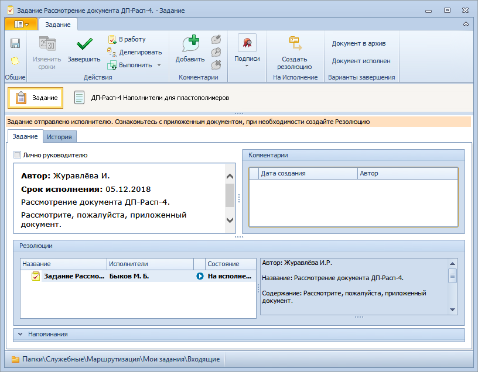

# Вкладка «Задание»

1. **Блок с общими сведениями о задании**. Заполняется автоматически.
2. **Комментарии** – комментарии к заданию. См. пункт [Добавление комментария к заданию](Add_Comments_Task.md).
3. **Лично руководителю** – установленный флаг показывает, что задание требует рассмотрения только назначенным исполнителем и потому не будет маршрутизировано в Папки Помощника исполнителя. Значение устанавливается щелчком левой клавиши мыши.
4. **Резолюции**.
   1. **Дерево резолюций** – отображает хода исполнения заданий подчиненной резолюции в виде упорядоченной иерархической структуры (дерева). См. пункт [Дерево резолюций](Tree_Resolution.md). Формируется автоматически при запуске резолюции на исполнение. Изменяется и дополняется автоматически при создании дочерних резолюций и внесении изменений в запущенную резолюцию.
5. **Напоминания**.
   1. **Напомнить за <...> часов** – позволяет настроить напоминание о том, что срок завершении задания истекает через указанное количество часов. Установите переключатель **Напомнить за** и введите срок напоминания вручную или с помощью счетчика. При этом должен быть открыт Microsoft Outlook.
   2. **Дата напоминания** – позволяет указать дату напоминания об истечении срока исполнения задания. Установите переключатель **Дата напоминания** и выберите дату с помощью календаря или введите вручную в формате, указанном в настройках операционной системы. При этом должен быть открыт Microsoft Outlook.