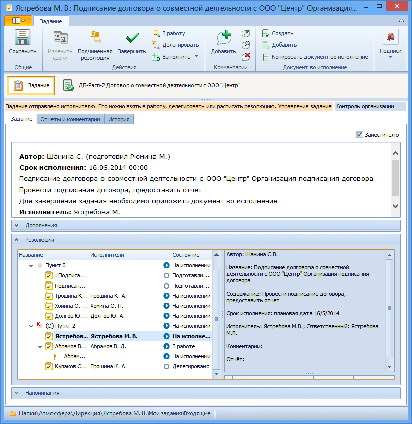

# Получение заданий Ответственным исполнителем

Исполнитель, назначенный ответственным за выполнение пункта резолюции, может не только выполнить свое собственное задание, но и управлять заданиями остальных исполнителей этого пункта: завершать и изменять сроки выполнения заданий.

Собственное задание ответственный [получает также, как и другие исполнители](Task_Take.md). Получить задания остальных исполнителей по пункту резолюции ответственный может следующими способами:

1. Из своего задания; для этого следует выполнить следующие действия: 

   1. Открыть карточку своего задания.

   2. В секции Резолюции установить курсор на строке своего задания и выбрать опцию контекстного меню **Показать дерево полностью**.

   3. В раскрывшемся дереве резолюций выделить узел, задание которого требуется открыть.

   4. Открыть карточку задания, нажав клавишу «Enter» или дважды щелкнув левой клавишей мыши.

      

2. Если администратором настроена виртуальная папка для отображения заданий пункта резолюции, в котором сотрудник назначен ответственным, следует перейти в эту папку, найти нужную карточку задания и открыть ее.