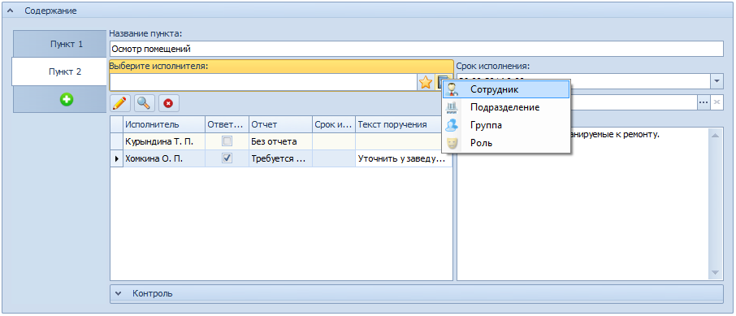

# Выбор исполнителя задания из Справочника сотрудников

Чтобы выбрать исполнителя из Справочник сотрудников, выполните следующие действия:

1. В поле Выберите исполнителя нажмите на кнопку  и выберите раздел Справочника сотрудников, из которого будет выбран исполнитель – Сотрудник, Подразделение, Группа или Роль.

   

   Будет открыт Справочник сотрудников в режиме выбора.

2. Выберите в справочнике нужную запись или несколько записей и нажмите кнопку выбора .

   В случае выбора записи подразделения, группы или роли, задания будут разосланы всем приписанным к ним сотрудникам.

   Выбранные элементы справочника будут добавлены в таблицу исполнителей.