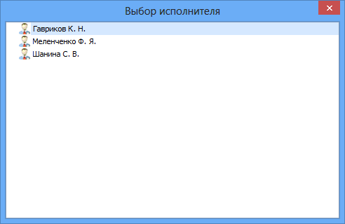

# Выбор исполнителя из сформированного списка

В Приложении автоматически формируется список из десяти исполнителей, фамилии которых последними выбирались при подготовке других резолюций данным регистратором.

Чтобы выбрать исполнителя из сформированного списка, выполните следующие действия:

1. В поле Выберите исполнителя нажмите на кнопку .

   Будет открыто окно со списком исполнителей.

   

2. Выберите в списке нужную запись. Если в задании нужно назначить нескольких исполнителей, повторите выбор.

   Выбранные элементы справочника будут отображены в поле Выберите исполнителей.

3. Закройте окно Выбор исполнителя.

4. Нажмите на клавиатуре клавишу «Enter».

Выбранные элементы справочника будут отображены в таблице исполнителей.