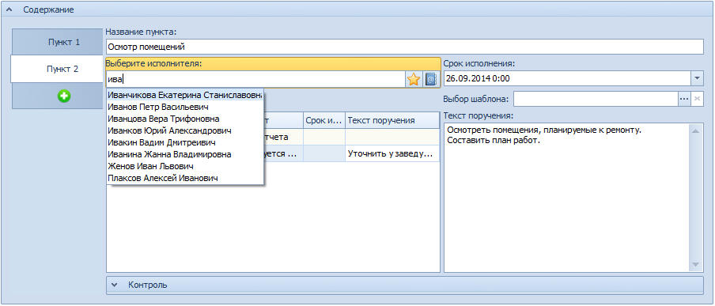

# Выбор исполнителя с помощью быстрого поиска

Чтобы выбрать исполнителя с помощью быстрого поиска, выполните следующие действия:

1. Введите в поле Выберите исполнителя несколько символов из ФИО исполнителя.

   

   В раскрывающемся списке будут представлены все найденные сотрудники, ФИО которых содержит указанные символы.

2. Выберите нужную запись и дважды щелкните по ней левой кнопкой мыши.

   Выбранная запись будет отображена в поле Выберите исполнителя.

3. Нажмите на клавиатуре клавишу «Enter».

   Выбранные фамилии будут отображены в таблице исполнителей.