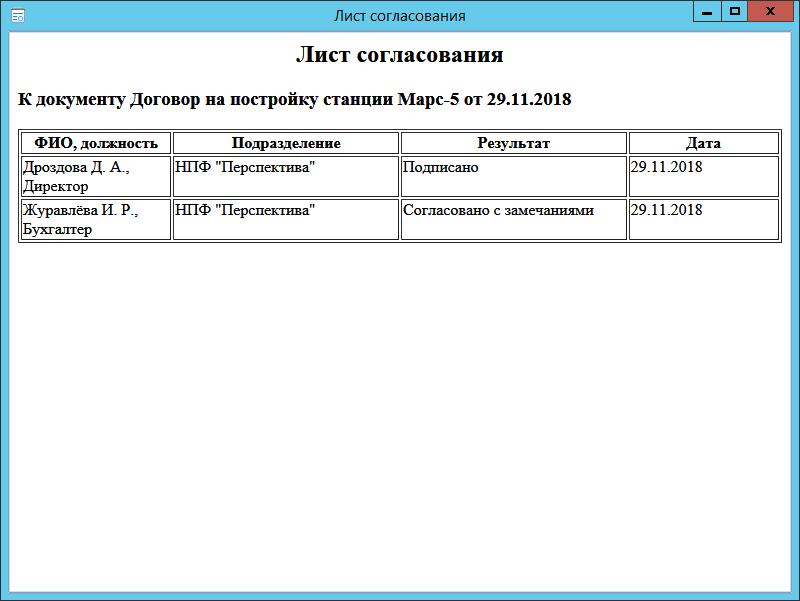

# Просмотр листа согласования

Для просмотра листа согласования документа выполните следующие действия:

1. Откройте карточку ДокументДП.

2. Нажмите кнопку ленты  Лист согласования.

   

   В таблице отображается список сотрудников, которые принимали участие в согласовании, а также последний результат из всех согласований.

   Если фактический исполнитель отличается от текущего, в графе ФИО, должность рядом с ФИО назначенного  исполнителя  в скобках указывается ФИО фактического исполнителя. Например:  Петров П.П. (за Сидорова С.С.), заместитель генерального директора.