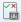
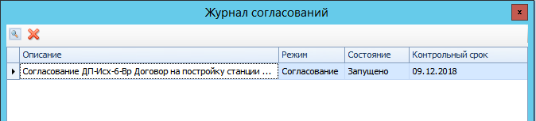

# Просмотр журнала согласования

Для просмотра Журнала согласования документа выполните следующие действия:

1. Откройте карточку ДокументДП.
2. Нажмите кнопку  ленты Журнал согласования. Будет открыто окно Журнал согласований, в котором будут показаны все карточки Согласование, которые были созданы из данной карточки ДокументДП. Любую карточку согласования можно открыть для анализа.      
   
3. Ознакомьтесь с ходом согласования.