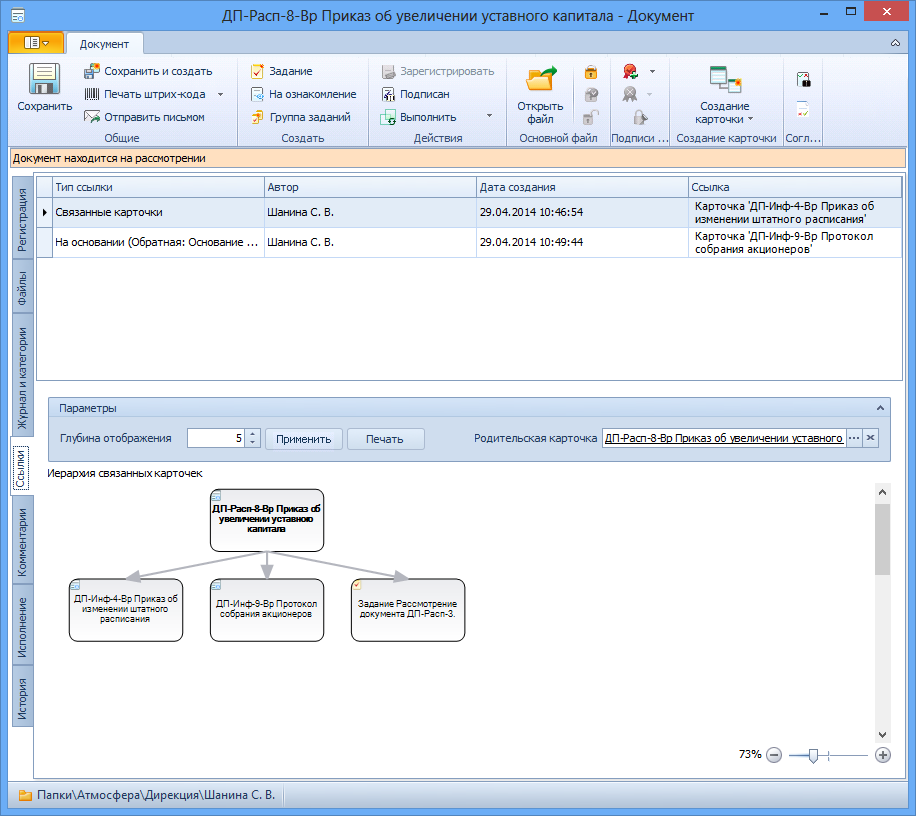

# Просмотр иерархии связанных карточек

Просмотреть иерархию связанных документов можно при помощи следующих действий:

1. Откройте карточку ДокументДП и перейдите на вкладку Ссылки.

   

2. В нижнем поле вкладки ознакомьтесь с Иерархией связанных карточек. Изменить глубину отображения дерева связей можно следующим образом:

   1. Перейдите к секции Параметры.
   2. В поле Глубина отображения с помощью счетчика или вручную установите нужный уровень глубины отображения дерева связанных карточек (например, карточка, непосредственно ссылающаяся на данную, имеет первый уровень, ссылающаяся на эту ссылку – второй и т. д).
   3. Нажмите кнопку **Применить**.

3. Поскольку один и тот же элемент может входить в различные цепочки, иерархию документов можно перестроить. Для этого перейдите к секции Параметры, нажмите кнопку выбора поля Родительская карточка и выберите в открывшемся окне другую родительскую карточку как начало цепочки. Очистить поле можно с помощью кнопки . В этом случае дерево будет перестроено от текущей карточки.

   Иерархия документов будет перестроена.